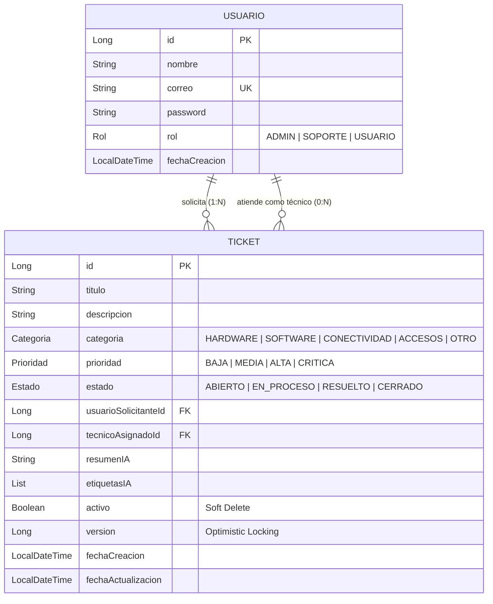
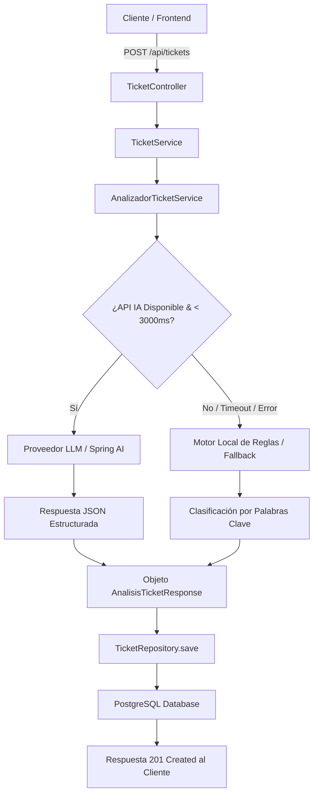

# 🎫 Sistema Inteligente de Gestión de Tickets (GestorIATickets)

[](https://oracle.com/java/)
[](https://spring.io/projects/spring-boot)
[](https://gradle.org/)
[](https://www.postgresql.org/)
[](https://www.docker.com/)

API RESTful desarrollada en **Java 21** y **Spring Boot** (`com.gestoria`) para la centralización y automatización del soporte técnico empresarial. El sistema incorpora Inteligencia Artificial para triaje automático (categorización, asignación de prioridad, resumen de máximo 30 palabras y etiquetas inteligentes), respaldado por un sistema de resiliencia mediante **Fallback por Reglas Locales**.

---

## 🚀 Entorno en Vivo

La aplicación se encuentra desplegada y la documentación interactiva de la API está disponible públicamente:  
👉 **[Ver Swagger UI en Render](https://gestoria-tickets-api.onrender.com/gestoria/tickets/api/swagger-ui/index.html)**

---

## 📋 Tabla de Contenidos

1. [Entorno en Vivo](#-entorno-en-vivo)
2. [Descripción del Proyecto](#-descripción-del-proyecto)
3. [Configuración de Gradle (`build.gradle`)](#-configuración-de-gradle-buildgradle)
4. [Arquitectura y Diagramas de Sistema](#-arquitectura-y-diagramas-de-sistema)
   - [Diagrama Entidad-Relación (Modelo de Datos)](#-diagrama-entidad-relación-modelo-de-datos)
   - [Diagrama de Flujo y Resiliencia (Fallback)](#-diagrama-de-flujo-y-resiliencia-fallback)
5. [Requisitos Previos](#-requisitos-previos)
6. [Variables de Entorno](#-variables-de-entorno)
7. [Instrucciones de Instalación y Ejecución](#-instrucciones-de-instalación-y-ejecución)
   - [Ejecución Local con Docker Compose](#opción-1-ejecución-con-docker-compose-recomendado)
   - [Ejecución en IntelliJ IDEA (Windows / Linux)](#opción-2-ejecución-desde-intellij-idea)
8. [Estrategia de Inteligencia Artificial y Resiliencia](#-estrategia-de-inteligencia-artificial-y-resiliencia)
9. [Decisiones Técnicas Obligatorias](#-decisiones-técnicas-obligatorias)
   - [Borrado Lógico (Soft Delete) vs. Borrado Físico](#1-decisión-de-eliminación-borrado-lógico-soft-delete)
   - [Portabilidad Windows ↔ Linux](#2-portabilidad-multiplataforma-windows-intelliij--linux)
10. [Documentación de la API (Endpoints)](#-documentación-de-la-api-endpoints)
    - [Ejemplos de Solicitud y Respuesta](#ejemplos-de-solicitudes)
11. [Pruebas Automatizadas](#-pruebas-automatizadas)
12. [Limitaciones Conocidas](#-limitaciones-conocidas)

---

## 🚀 Descripción del Proyecto

El **Sistema Inteligente de Gestión de Tickets** permite a los empleados de una organización registrar solicitudes de soporte técnico proporcionando únicamente un título y una descripción corta.

Al registrar la solicitud (`POST /api/tickets`), el sistema desencadena un flujo automatizado que:
* Analiza la descripción mediante un modelo de lenguaje (LLM) o motor de reglas local.
* Clasifica el incidente en una **Categoría** (`HARDWARE`, `SOFTWARE`, `CONECTIVIDAD`, `ACCESOS`, `OTRO`).
* Determina el nivel de **Prioridad** (`BAJA`, `MEDIA`, `ALTA`, `CRITICA`).
* Sintetiza un **Resumen corto** de máximo 30 palabras.
* Asigna entre 1 y 5 **Etiquetas inteligentes**.

---

## 📦 Configuración de Gradle (`build.gradle`)

El proyecto utiliza **Gradle** con Java 21 como toolchain base (`JavaLanguageVersion.of(21)`). A continuación se detalla la configuración clave del archivo `build.gradle`:

```groovy
plugins {
    id 'java'
    id 'org.springframework.boot' version '4.1.1' // Spring Boot Plugin
    id 'io.spring.dependency-management' version '1.1.7'
}

group = 'com.gestoria'
version = '0.0.1-SNAPSHOT'

java {
    toolchain {
        languageVersion = JavaLanguageVersion.of(21)
    }
}

repositories {
    mavenCentral()
}

dependencies {
    // 1. Núcleo y Web
    implementation 'org.springframework.boot:spring-boot-starter-web'
    implementation 'org.springframework.boot:spring-boot-starter-validation'

    // 2. Persistencia y Base de Datos (PostgreSQL & Flyway)
    implementation 'org.springframework.boot:spring-boot-starter-data-jpa'
    runtimeOnly 'org.postgresql:postgresql'
    implementation 'org.springframework.boot:spring-boot-starter-flyway'
    implementation 'org.flywaydb:flyway-database-postgresql'

    // 3. Testing
    testImplementation 'org.springframework.boot:spring-boot-starter-test'
}

tasks.named('test') {
    useJUnitPlatform()
}
```

---

## 🏗️ Arquitectura y Diagramas de Sistema

El proyecto sigue una arquitectura en capas limpia (*Clean Layered Architecture*) bajo el paquete `com.gestoria`:

```text
src/main/java/com/gestoria/
├── ai/          # Clientes de IA, Prompts, Estrategia Fallback y Clasificador Local
├── config/      # Configuración de OpenAPI, JPA, Security y Beans de IA
├── controller/  # Controladores REST API (@RestController)
├── dto/         # Objetos de Transferencia de Datos (Request/Response DTOs)
├── entity/      # Entidades JPA (@Entity) con auditoría y soft delete
├── exception/   # Manejador global de excepciones (@RestControllerAdvice)
├── mapper/      # Mapeadores de conversión entre Entidades y DTOs
├── repository/  # Interfaces Spring Data JPA con consultas personalizadas
└── service/     # Lógica de negocio e interfaces de servicios
```

---

### 🗄️ Diagrama Entidad-Relación (Modelo de Datos)



---

### 🔄 Diagrama de Flujo y Resiliencia (Fallback)



---

## 💻 Requisitos Previos

* **Java Development Kit (JDK)**: 21 (configurado en el toolchain de Gradle).
* **Gestor de Construcción**: Gradle (con Gradle Wrapper `./gradlew`).
* **Docker & Docker Compose**: Versión 24.0+ / 2.20+ (para PostgreSQL y entorno aislado).
* **IDE**: IntelliJ IDEA 2023.3+ (compatible con Windows y Linux).

---

## 🔑 Variables de Entorno

Crea un archivo `.env` en la raíz del proyecto basándote en el archivo incluido `.env.example`:

```bash
# Configuración del Servidor
SERVER_PORT=8080

# Configuración de Base de Datos PostgreSQL
DB_URL=jdbc:postgresql://localhost:5432/tickets_db
DB_USERNAME=postgres
DB_PASSWORD=postgres
DB_DRIVER=org.postgresql.Driver

# Configuración del Proveedor de Inteligencia Artificial (OpenAI / Spring AI / Gemini)
AI_PROVIDER=openai
AI_API_KEY=tu_api_key_aqui_sin_comillas
AI_MODEL=gpt-4o-mini
AI_TIMEOUT_MS=3000

# Configuración de Perfiles Spring
SPRING_PROFILES_ACTIVE=dev
```

> ⚠️ **Seguridad**: No subas archivos `.env` con credenciales reales a Git. El archivo `.gitignore` ya excluye `.env`.

---

## 🛠️ Instrucciones de Instalación y Ejecución

### Opción 1: Ejecución con Docker Compose (Recomendado)

Esta opción levanta tanto la base de datos PostgreSQL como la aplicación compilada:

```bash
# 1. Clonar el repositorio
git clone https://github.com/juan1016g/GestorIATickets.git
cd GestorIATickets

# 2. Copiar archivo de entorno
cp .env.example .env

# 3. Construir y levantar servicios en segundo plano
docker compose up -d --build

# 4. Verificar estado de los contenedores
docker compose ps
```

La aplicación estará disponible en `http://localhost:8080`.

---

### Opción 2: Ejecución desde IntelliJ IDEA

#### En Windows:
1. Abrir IntelliJ IDEA -> `File` -> `Open` y seleccionar la carpeta del proyecto.
2. Asegurarse de que el SDK del proyecto esté configurado en **JDK 21**.
3. Levantar la base de datos PostgreSQL mediante Docker:
   ```cmd
   docker compose up -d postgres
   ```
4. Configurar las variables de entorno en el Run Configuration (`Run` -> `Edit Configurations...` -> `Environment Variables`) cargando los valores de `.env`.
5. Ejecutar la clase principal `GestorIATicketsApplication.java`.

#### En Linux / macOS:
1. Asegurar permisos de ejecución para el wrapper de Gradle:
   ```bash
   chmod +x gradlew
   ```
2. Ejecutar la aplicación mediante consola o IntelliJ:
   ```bash
   ./gradlew bootRun
   ```

---

## 🤖 Estrategia de Inteligencia Artificial y Resiliencia

Se implementó el patrón **Strategy + Resilience Fallback** a través de la interfaz `AnalizadorTicketService`:

```java
public interface AnalizadorTicketService {
    AnalisisTicketResponse analizar(String titulo, String descripcion);
}
```

### 1. Proveedor Primario (LLM Externo / Spring AI)
* Utiliza Prompts estructurados para exigir la salida estricta en formato JSON.
* Incorpora delimitadores de seguridad para mitigar ataques de *Prompt Injection*.
* Limita el resumen a un máximo de 30 palabras y fuerza de 1 a 5 etiquetas.

### 2. Motor de Fallback Local (Resilience4j / Rule Engine)
Si la llamada a la API externa supera el tiempo límite (*Timeout* de 3000 ms), sufre problemas de red o cuota agotada:
* El sistema activa automáticamente el **Clasificador Local basado en Reglas y Palabras Clave**:
  * Palabras como `"wifi"`, `"internet"`, `"red"` -> Categoría `CONECTIVIDAD`.
  * Palabras como `"password"`, `"contraseña"`, `"login"` -> Categoría `ACCESOS`.
  * Palabras como `"pantalla"`, `"teclado"`, `"computador"` -> Categoría `HARDWARE`.
  * Palabras como `"urgente"`, `"caído"`, `"reunión"` -> Prioridad `ALTA` / `CRITICA`.
* Garantiza la disponibilidad del sistema (SLA 99.9%) sin bloquear al usuario.

---

## 📌 Decisiones Técnicas Obligatorias

### 1. Decisión de Eliminación: Borrado Lógico (Soft Delete)
Se implementó **Borrado Lógico (Soft Delete)** mediante el campo `activo` (`boolean`) y las anotaciones de Hibernate `@SQLDelete(sql = "UPDATE ticket SET activo = false WHERE id = ?")` y `@Where(clause = "activo = true")`.

* **Justificación**: En sistemas de gestión de TI y soporte técnico (ITIL), la eliminación física destruye el historial de auditoría, las métricas de SLAs y la trazabilidad de incidentes reportados por los usuarios. Con el borrado lógico, las consultas estándar ignoran los tickets eliminados, pero se conserva la integridad referencial y la información histórica para reportes gerenciales.

### 2. Portabilidad Multiplataforma (Windows IntelliJ ↔ Linux)
Para garantizar el desarrollo fluido en Windows (IntelliJ IDEA) y su despliegue inmediato en entornos Linux:
* **Fin de línea `.gitattributes`**: Se incluyó una regla de Git (`* text=auto eol=lf`) para forzar saltos de línea `LF` en scripts y código fuente, evitando errores `
: command not found` en bash.
* **Permisos de Wrappers**: El archivo `gradlew` cuenta con bits de ejecución activados en Git (`git update-index --chmod=+x gradlew`).
* **Bases de Datos e Invarianza de Nombres**: Se utilizaron minúsculas en esquemas y tablas (`snake_case`) para evitar incompatibilidades con la sensibilidad a mayúsculas/minúsculas (*case-sensitivity*) de los sistemas de archivos Linux.

---

## 📑 Documentación de la API (Endpoints)

Base URL: `http://localhost:8080/api`  
Documentación Swagger / OpenAPI interactiva en vivo: **[Ver Swagger UI en Render](https://gestoria-tickets-api.onrender.com/gestoria/tickets/api/swagger-ui/index.html)**

| Método | Endpoint | Descripción | Roles Permitidos |
| :--- | :--- | :--- | :--- |
| **POST** | `/api/tickets` | Crea un ticket y ejecuta el triaje con IA | `USUARIO`, `ADMIN`, `SOPORTE` |
| **GET** | `/api/tickets` | Consulta tickets con filtros y paginación | Todos |
| **GET** | `/api/tickets/{id}` | Obtiene el detalle completo de un ticket | Todos |
| **PATCH** | `/api/tickets/{id}/estado` | Actualiza el estado del ticket | `SOPORTE`, `ADMIN` |
| **PATCH** | `/api/tickets/{id}/asignar` | Asigna un técnico al ticket | `SOPORTE`, `ADMIN` |
| **DELETE** | `/api/tickets/{id}` | Realiza el borrado lógico del ticket | `ADMIN` |

### Ejemplos de Solicitudes

#### 1. Crear un Ticket (`POST /api/tickets`)
**Request Body:**
```json
{
  "titulo": "Problema con internet",
  "descripcion": "Desde esta mañana no puedo conectarme a internet y tengo una reunión importante en 20 minutos.",
  "usuarioId": 1
}
```

**Response (201 Created):**
```json
{
  "id": 25,
  "titulo": "Problema con internet",
  "descripcion": "Desde esta mañana no puedo conectarme a internet y tengo una reunión importante en 20 minutos.",
  "categoria": "CONECTIVIDAD",
  "prioridad": "ALTA",
  "estado": "ABIERTO",
  "resumenIA": "Usuario sin conexión a internet antes de una reunión importante.",
  "etiquetasIA": [
    "internet",
    "conectividad",
    "reunión"
  ],
  "solicitante": {
    "id": 1,
    "nombre": "Laura Gómez",
    "correo": "laura.gomez@empresa.com"
  },
  "tecnicoAsignado": null,
  "fechaCreacion": "2026-09-17T10:15:30Z",
  "fechaActualizacion": "2026-09-17T10:15:30Z"
}
```

#### 2. Consultar Tickets con Filtros y Paginación (`GET /api/tickets`)
**Query Params:** `/api/tickets?estado=ABIERTO&prioridad=ALTA&page=0&size=10&sort=fechaCreacion,desc`

#### 3. Asignar Técnico (`PATCH /api/tickets/25/asignar`)
**Request Body:**
```json
{
  "tecnicoId": 5
}
```

---

## 🧪 Pruebas Automatizadas

El proyecto incluye un conjunto completo de pruebas unitarias y de integración desarrolladas con **JUnit 5**, **Mockito** y **MockMvc**:

```bash
# Ejecutar todas las pruebas unitarias e integración con Gradle
./gradlew test

# Generar reporte de cobertura con JaCoCo
./gradlew jacocoTestReport
```

### Casos de Prueba Incluidos:
1. `crearTicket_ConAnalisisIA_Exitoso()`: Verifica persistencia y triaje.
2. `analizarTicket_ConFallback_PorErrorIA()`: Comprueba que el motor de reglas responda si el LLM falla.
3. `consultarTicket_Inexistente_LanzaException404()`: Valida el manejo de excepciones `ResourceNotFoundException`.
4. `asignarTecnico_UsuarioConRolUsuario_LanzaException400()`: Verifica la regla de negocio (solo usuarios con rol `SOPORTE`).
5. `actualizarEstado_FlujoValido_CambiaEstado()`: Valida el cambio de estado de `ABIERTO` a `EN_PROCESO`.

---

## ⚠️ Limitaciones Conocidas

1. **Latencia Variable de la API de IA**: Las llamadas a modelos remotos en la nube pueden agregar entre 500ms y 2000ms al tiempo de respuesta del `POST /api/tickets`. Se mitiga mediante el timeout y el fallback local.
2. **Límite de Rate-Limiting en Proveedores Gratuitos**: En entornos de prueba intensiva, las claves gratuitas pueden sufrir *HTTP 429 Too Many Requests*. En este escenario, el sistema conmuta sin interrupción al motor de reglas.
